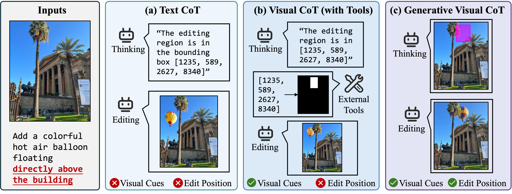

# Generative Visual Chain-of-Thought for Image Editing

<div align="center">
  <a href="https://pris-cv.github.io/GVCoT/"></a> &ensp;
  <a href="https://arxiv.org/abs/2603.01893"></a> &ensp;
  <a href="#"></a> &ensp;
</div>

> 
> Zijin Yin<sup>1,2,†</sup>, Tiankai Hang<sup>2</sup>, Yiji Cheng<sup>2</sup>, Shiyi Zhang<sup>2</sup>, Runze He<sup>2</sup>, Yu Xu<sup>2</sup>, Chunyu Wang<sup>2,‡</sup>, Bing Li<sup>3</sup>, Zheng Chang<sup>1</sup>, Kongming Liang<sup>1,§</sup>, Qinglin Lu<sup>2</sup>, Zhanyu Ma<sup>1</sup>
> 
> <sup>1</sup>Beijing University of Posts and Telecommunications, <sup>2</sup>Tencent Hunyuan, <sup>3</sup>King Abdullah University of Science and Technology



> Existing image editing methods struggle to perceive where to edit, especially under complex scenes and nuanced spatial instructions. To address this issue, we propose **Generative Visual Chain-of-Thought (GVCoT)**, a unified framework that performs native visual reasoning by first generating spatial cues to localize the target region and then executing the edit. Unlike prior text-only CoT or tool-dependent visual CoT paradigms, GVCoT jointly optimizes visual tokens generated during the reasoning and editing phases in an end-to-end manner. This way fosters the emergence of innate spatial reasoning ability and enables more effective utilization of visual-domain cues. The main challenge of training GCVoT lies in the scarcity of large-scale editing data with precise edit region annotations; to this end, we construct **GVCoT-Edit-Instruct**, a dataset of 1.8M high-quality samples spanning 19 tasks. We adopt a progressive training strategy: supervised fine-tuning to build foundational localization ability in reasoning trace before final editing, followed by reinforcement learning to further improve reasoning and editing quality. Finally, we introduce **SREdit-Bench**, a new benchmark designed to comprehensively stress-test models under sophisticated scenes and fine-grained referring expressions. Experiments demonstrate that GVCoT consistently outperforms state-of-the-art models on SREdit-Bench and ImgEdit. 

---
## 🔥 News 
- **[2026/03]** The [Project Page](https://zijiny.github.io/GVCoT/) is now live. Code and dataset will be released soon.

## 📌 TODO
- [x] Release project page.
- [ ] Release paper on arXiv.
- [ ] Release GVCoT-Edit-Instruct dataset.
- [ ] Release inference code and model weights.

## 📖 BibTeX
```bibtex
@inproceedings{yin2026gvcot,
      title={Generative Visual Chain-of-Thought for Image Editing}, 
      author={Zijin Yin and Tiankai Hang and Yiji Cheng and Shiyi Zhang and Runze He and Yu Xu and Chunyu Wang and Bing Li and Zheng Chang and Kongming Liang and Qinglin Lu and Zhanyu Ma},
      year={2026},
      booktitle={Arxiv}
}
